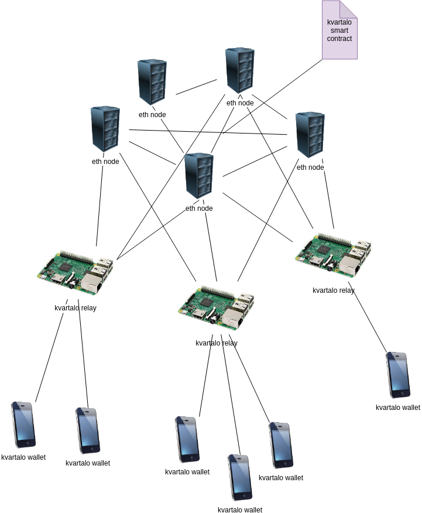

# Technology

### Architecture

- deployed over a Ethereum PoA

 

### Components
- [token](https://github.com/kvartalo/token)
- [relay](https://github.com/kvartalo/relay)
- [web-wallet](https://github.com/kvartalo/web-wallet)

## Usability tradeoffs for the first version
- common addresses limited to maximum of 20`kvt`
	- it's a low amount for the first phase of the experiment
	- to avoid acumulation and risks
	- 20`eur` is a typical amount that people have in their pockets in a 20`eur` bill format
- shop addresses will be able to hold more `kvt`, as they will need to accumulate the transactions of the payments
- a proposal could be that the products selled in `kvt` will have some kind of % discount, to incentivize the use of `kvt` instead of `eur`
